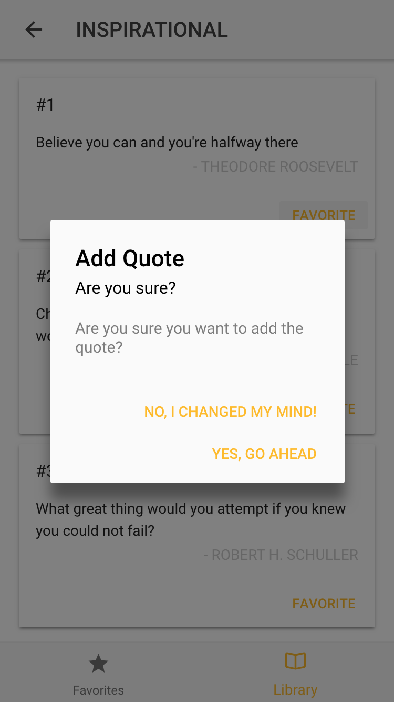

# ionic-quotes-app
## USES:
cards, modals, ion-grid, ion-list, tabs-nav, theme, alerts, modal-page data transfer, side-menu, alt-background, page-stack

<kbd></kbd>
<kbd></kbd>
<kbd></kbd>
<kbd></kbd>
<kbd></kbd>
<kbd></kbd>
<kbd></kbd>
<kbd></kbd>
<kbd></kbd>
<kbd></kbd>
